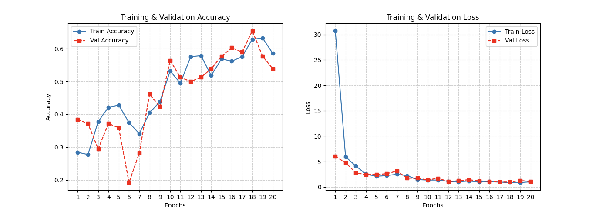

# Food Recognition and Macro Estimation using Trained Model

## Project Description
This project aims to create a model that analyzes food images to estimate calories and macronutrients (protein, carbs, fats). Users can take a picture of their meal, and the model will provide corresponding nutritional information.

## Project Goals
- Identify food items from images.
- Estimate macronutrients and calorie content.
- Build a machine learning model for food recognition.

## Data Collection
We will gather images and nutritional data from:
- Open source food datasets (e.g., Food-101, UEC FOOD 256).
- Nutrition databases like USDA FoodData Central.

## Model Training
- Use deep learning (e.g., CNNs like ResNet) for food classification.
- Implement weight estimation techniques using image processing and reference data.
- Retrieve nutritional data via an external API.
- Implement and test using TensorFlow/PyTorch/Sckit-Learn.

## Data Visualization
- Display food recognition results with estimated weight, calorie, and macronutrient breakdown.
- Create pie charts to show the proportion of macronutrients (protein, carbs, fats) in each identified food item.
- Implement bar graphs to compare calorie content across different food items in a meal.
- Utilize residual plots to measure accuracy of the prediction to test the model
- Isolate parameters to examine the importance of each parameter on accuracy
- Design a simple, color-coded nutritional label for each recognized food item, similar to standard food packaging labels.

## Test Plan
- Use 80% of data for training and 20% for testing.
- Evaluate accuracy using real-world images.
- Compare model estimates with actual nutrition data.

## Midterm Progress Report

### Data Processing
1. Dataset Organization:
   - Successfully organized four categories of the UEC FOOD 256 dataset into training and validation sets
   - Implemented data splitting with 80% training and 20% validation ratio
   - Preprocessed images to a consistent size (224x224) for model input

2. Data Augmentation:
   - We create variations of our training images to help the model learn better:
     - Rotating images (up to 30 degrees) to recognize food from different angles
     - Shifting images horizontally and vertically (20% range) to handle different positions
     - Stretching and squishing images (20% range) to handle different distances
     - Zooming in and out (20% range) to handle different sizes
     - Flipping images horizontally to handle different orientations
   - This helps the model learn to recognize food regardless of how it's photographed
   - We also normalize the images (adjusting brightness and contrast) to make training more consistent

### Model Implementation
1. Architecture:
   - We're using a pre-trained model called ResNet50 that already knows how to recognize general features in images
     - Think of it like a model that already knows how to identify basic shapes, textures, and patterns from being trained on millions of images
   - We've modified this model to specifically recognize food by:
     - Keeping the model's basic knowledge of image features (like edges, shapes, textures)
     - Adding new layers that learn to identify food-specific features
     - Setting up the final layer to classify different types of food
   - This approach is called "transfer learning" - we're taking a model that's good at general image recognition and teaching it to focus on food

2. Training Process:
   - We've set up the training to be efficient and prevent the model from learning too much from the training data:
     - The model stops training when it stops improving (early stopping)
     - It adjusts its learning speed automatically when progress slows down
     - We process 32 images at a time to balance speed and accuracy
   - The model is set up to recognize multiple types of food at once

### Preliminary Results
1. Model Performance:
   - Successfully trained the model on the food dataset
   - Implemented visualization of training metrics:
     - Training and validation accuracy plots
     - Training and validation loss plots
   - Model shows promising convergence patterns

2. Data Visualization:
   - Created comprehensive training history visualizations
   - Implemented plots showing:
     - Training vs. Validation accuracy over epochs
     - Training vs. Validation loss over epochs
   - Visualizations help in monitoring model performance and identifying potential issues

*Training and validation metrics over epochs. The left plot shows the accuracy progression, while the right plot displays the loss values. The model demonstrates good convergence with both training and validation metrics improving over time. The gap between training and validation metrics indicates some overfitting, which we plan to address in future iterations.*

### Next Steps
1. Calorie Estimation:
   - Integrate with USDA FoodData Central API for nutritional information

2. Model Improvements:
   - Fine-tune hyperparameters
   - Implement additional data augmentation techniques
   - Add model evaluation metrics
