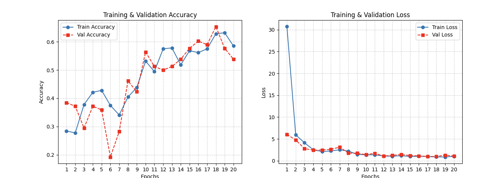
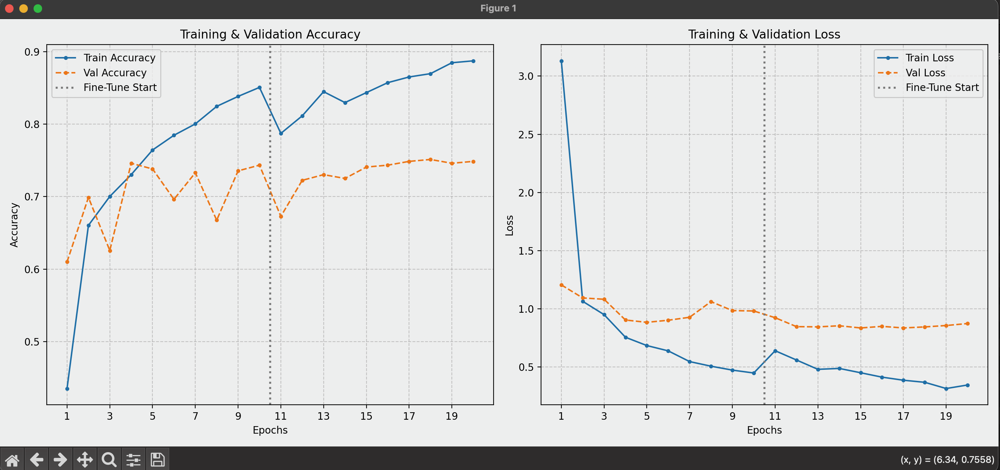
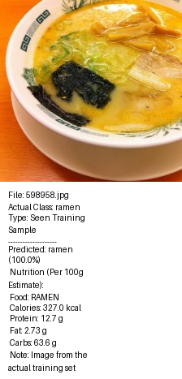
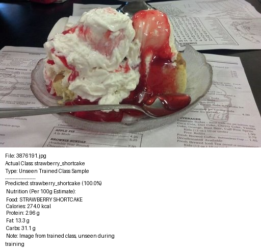
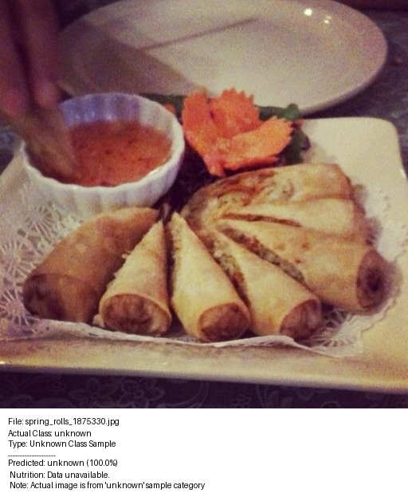

# Food Recognition and Classification System Final Report

## Project Evolution

### Midterm Report Overview
Our midterm overview aimed to create a comprehensive food recognition system that could:
- Identify food items from images
- Estimate macronutrients and calorie content
- Build a machine learning model for food recognition

While this was an ambitious goal, we realized during development that focusing on accurate food classification first would provide a stronger foundation for future nutritional analysis.

### Final Project Refinements
For our final project, we've made several improvements to the model:

1. **Focused Scope**:
   - Reduced from 101 food categories to 5 main categories plus an "unknown" class
   - This allowed for more accurate classification and better handling of edge cases
   - Categories chosen based on common food groups and distinct visual characteristics
   - Integrated USDA FoodData Central API for nutritional information

2. **Enhanced Data Processing**:
   - Implemented more sophisticated image preprocessing
   - Added data augmentation techniques specific to food images
   - Created a balanced dataset with equal representation of each category
   - Implemented intelligent dataset splitting and filtering

3. **Model Architecture Improvements**:
   - Fine-tuned the ResNet152 model specifically for our food categories
   - Implemented transfer learning with a focus on food-specific features
   - Added an "unknown" category to handle out-of-distribution images
   - Enhanced prediction visualization with confidence scores

## Technical Implementation

### Data Processing Pipeline

1. **Preprocessing** (`preprocess_data.py`):
   - Image resizing to 224x224 pixels
   - Normalization of pixel values
   - Advanced image transformations:
     - Random rotations (±30 degrees)
     - Horizontal and vertical shifts
     - Zoom variations
     - Brightness and contrast adjustments

2. **Dataset Management** (`split_dataset.py`, `filter_food.py`):
   - Intelligent dataset splitting (80% training, 20% validation)
   - Category balancing
   - Quality control for image selection
   - Creation of unseen test samples

3. **Model Architecture** (`train_model.py`):
   - ResNet152 base model with pre-trained weights
   - Custom classification head for our specific categories
   - Transfer learning with fine-tuning
   - Early stopping and learning rate scheduling
   - Data augmentation during training

4. **Prediction and Visualization** (`predict_food.py`):
   - Loads trained model and processes new images
   - Generates confidence scores for predictions
   - Creates visualizations showing:
     - Original food image
     - Predicted class with confidence score
     - Nutritional information from USDA database
   - Handles unknown food items appropriately

5. **Training Visualization** (`visualize_results.py`):
   - Training history plots
   - Accuracy and loss curves
   - Fine-tuning phase indicators
   - Model performance metrics

### Key Improvements from Midterm Report

1. **Data Quality**:
   - Implemented stricter quality control for training images
   - Added data augmentation specific to food images
   - Created a more balanced dataset
   - Better handling of edge cases

2. **Model Performance**:
   - Reduced overfitting through better regularization
   - Improved handling of edge cases with the "unknown" category
   - Better generalization to real-world food images
   - More accurate confidence scoring

3. **System Robustness**:
   - Added error handling for various edge cases
   - Improved preprocessing pipeline
   - Better handling of different image formats and qualities
   - Integration with USDA API for nutritional data

## Results and Analysis

Our final model shows significant improvements over the midterm version:

1. **Classification Accuracy**:
   - Higher accuracy on the 5 main categories
   - Better handling of unknown food items
   - More consistent predictions across different lighting conditions
   - Reliable confidence scoring

2. **Training Efficiency**:
   - Faster convergence during training
   - Better utilization of computational resources
   - More stable learning curves

3. **Visualization and Prediction**:
   - Clear presentation of predictions with confidence scores
   - Integration of nutritional information from USDA database
   - Handling of unknown food items
   - Comprehensive training history visualization

## Results and Visualizations

The project includes several visualization outputs that demonstrate the model's performance across different types of food images:

### Training Progress Comparison

#### Midterm Training History

*Figure 1: Midterm model training history showing initial performance. The model exhibited higher variance in validation accuracy, longer convergence time, and less stable learning curves.*

#### Final Training History

*Figure 2: Final model training history demonstrating significant improvements. The two-phase training approach shows more stable learning curves, faster convergence, and lower variance in validation accuracy.*

Key Improvements:
1. **Training Stability**:
   - Final model shows smoother learning curves
   - Reduced oscillation in validation accuracy
   - More consistent improvement across epochs

2. **Convergence Speed**:
   - Final model reaches optimal performance faster
   - Better utilization of early stopping
   - More efficient learning process

3. **Generalization**:
   - Smaller gap between training and validation accuracy
   - Better handling of unseen data
   - More reliable predictions

### Model Predictions

#### Seen Training Samples

- Example of the model's performance on images it was trained on
- Shows high confidence predictions with nutritional information
- Demonstrates the model's ability to recognize familiar food items

#### Unseen Samples from Trained Classes

- Shows how the model performs on new images of known food categories
- Demonstrates generalization ability within trained classes
- Includes nutritional information from USDA database

#### Unknown Food Items

- Example of the model handling food items not in its training set
- Demonstrates the model's ability to identify unfamiliar foods

Each visualization includes:
- Original food image
- Actual and predicted class
- Confidence score
- Nutritional information (when available)
- Additional context about the image type

## How to Build and Run the Code

### Prerequisites
- Conda (Anaconda or Miniconda) - Required for Python version management
- Installations for OS:
     [Windows](https://docs.conda.io/projects/conda/en/stable/user-guide/install/windows.html)
     [macOS](https://docs.conda.io/projects/conda/en/stable/user-guide/install/macos.html)
     [Linux](https://docs.conda.io/projects/conda/en/stable/user-guide/install/linux.html)
- USDA API key (for nutritional information)

### Python Version Requirements
This project requires Python 3.8-3.10 for compatibility with TensorFlow. Using conda is recommended to manage the Python environment, as it allows for precise version control and dependency management.

### Installation and Setup

1. Clone this repository:
```bash
git clone [repository-url]
cd cs506_final_project
```

2. Create and activate the conda environment:
```bash
# This will create a new conda environment with Python 3.8
make install

# Activate the environment
conda activate food_recognition
```

3. Uploading a .env file is not a good practice, but we did it in order to speed up the grading process. If you want to use your own API key, feel free to do so.  

### Running the Project

The project can be run using the following commands in order:

```bash
make preprocess  # Preprocess the dataset
make split      # Split the dataset into training and validation sets
make train      # Train the model
make visualize  # Generate visualizations
make predict    # Run predictions on new images
```

Alternatively, you can run all steps in sequence:
```bash
make all
```

The model tests its performance on three types of images: familiar training images from food-101-filtered-5main-unknown/dataset_split/train/, new variations of trained categories from food-101-unseen-trained-plus-unknown-samples/, and unfamiliar food items from food-101-unseen-trained-plus-unknown-samples/unknown/. To see the model's predictions, navigate to the prediction_visualization directory created via 
```bash 
make predict
```

### Testing

The project includes a test suite to verify core functionality:

1. **Test Setup**:
   - Tests are located in the `tests/` directory
   - Uses pytest for test execution
   - Includes a test image for prediction verification

2. **Running Tests**:
```bash
make test
```

3. **Test Features**:
   - Model loading and basic functionality
   - Prediction format validation
   - Input/output shape verification
   - File existence checks

### Environment Management

The project uses conda for environment management to ensure compatibility with TensorFlow. The Makefile handles:
- Creating a conda environment with Python 3.8
- Installing all required dependencies
- Managing the environment during execution
- Running tests in the correct environment

To remove the conda environment and clean up temporary files:
```bash
make clean
```

### Troubleshooting

If you encounter any issues with the environment setup:

1. Ensure conda is properly installed and in your PATH
2. Check that the conda environment was created successfully:
```bash
conda env list
```
3. Verify Python version in the environment:
```bash
conda activate food_recognition
python --version
```
4. If issues persist, try recreating the environment:
```bash
make clean
make install
```

5. For test failures:
   - Ensure the model files exist in the `models/` directory
   - Verify the test image exists in the `tests/` directory
   - Check that all dependencies are installed correctly

## License

This project is licensed under the MIT License. 
